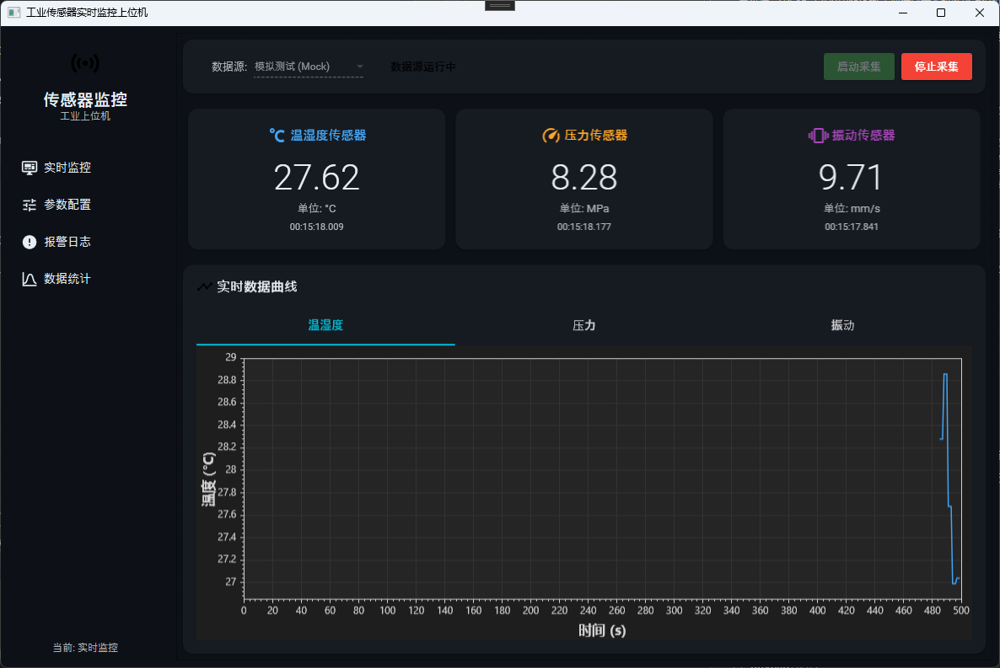

# 工业传感器实时监控上位机

基于 **.NET 8 + WPF + Material Design** 构建的工业传感器实时数据监控系统，支持多数据源接入、实时曲线展示、报警管理、数据持久化与统计分析。

## 功能特性

### 📊 实时监控
- 多传感器数据实时采集与展示（温湿度、压力、振动等）
- 实时折线图动态呈现传感器数值变化趋势
- 当前值、最小值、最大值、平均值的即时显示
- 支持 **Mock / 串口 / TCP** 三种数据源切换

### ⚠️ 报警管理
- 支持上下限阈值报警（值高于上限或低于下限触发）
- 报警实时弹窗通知与声音提示
- 报警历史记录查询与导出

### ⚙️ 参数配置
- 传感器参数灵活配置（名称、类型、单位、量程、报警阈值）
- 数据源切换（Mock / COM 串口 / TCP 网络）
- 串口参数（端口号、波特率等）与 TCP 参数（IP、端口）配置
- 采样间隔与缓存点数可调
- 配置持久化到本地 JSON 文件

### 📈 数据统计
- 按传感器维度的统计汇总
- 均值、最大/最小值、标准差等统计指标
- 数据分布可视化（直方图）

### 💾 数据持久化
- **CSV 文件存储**：按日期分文件，缓冲批量写入（每 50 条刷写一次）
- **SQLite 数据库存储**（可选）：结构化查询、高效率检索
- 支持时间段筛选导出

## 🖥️ 软件界面



*左侧深色导航栏 + 右侧内容区域，工业青（Cyan）主题配色*

## 技术栈

| 技术 | 说明 |
|------|------|
| **.NET 8** | 目标框架 |
| **WPF** | 桌面 UI 框架 |
| **Material Design Themes** | Material Design 风格 UI 控件库 |
| **CommunityToolkit.Mvvm** | MVVM 架构支持（源生成器） |
| **LiveChartsCore** | 实时数据图表 |
| **CsvHelper / SQLite** | 数据持久化 |
| **Microsoft.Extensions.Hosting** | 依赖注入与生命周期管理 |
| **Serilog** | 结构化日志 |

## 项目结构

```
工业传感器实时监控上位机/
├── Models/                  # 数据模型
│   ├── SensorData.cs        # 传感器数据模型
│   ├── SensorConfig.cs      # 传感器配置模型
│   └── AlarmRecord.cs       # 报警记录模型
├── ViewModels/              # 视图模型（MVVM）
│   ├── MainViewModel.cs     # 主窗口导航
│   ├── MonitorViewModel.cs  # 实时监控
│   ├── ConfigViewModel.cs   # 参数配置
│   ├── AlarmLogViewModel.cs # 报警日志
│   └── StatisticsViewModel.cs # 数据统计
├── Views/                   # WPF 视图
│   ├── MonitorView.xaml     # 监控面板
│   ├── ConfigView.xaml      # 配置面板
│   ├── AlarmLogView.xaml    # 报警日志
│   └── StatisticsView.xaml  # 统计面板
├── Services/                # 业务服务层
│   ├── ISensorSource.cs     # 数据源接口
│   ├── MockSensorSource.cs  # 模拟数据源
│   ├── SerialSensorSource.cs# 串口数据源
│   ├── TcpSensorSource.cs   # TCP 数据源
│   ├── IDataStorage.cs      # 数据存储接口
│   ├── CsvDataStorage.cs    # CSV 持久化
│   ├── SqliteDataStorage.cs # SQLite 持久化
│   ├── IAlarmService.cs     # 报警服务接口
│   ├── AlarmService.cs      # 报警服务
│   ├── DialogService.cs     # 对话框服务
│   └── ...                  # 其他服务
├── Resources/               # 资源文件夹（图标、样式、字体等）
├── App.xaml / App.xaml.cs   # 应用入口与 DI 配置
├── MainWindow.xaml          # 主窗口
└── tests/                   # 单元测试
```

## 快速开始

### 环境要求
- [.NET 8 SDK](https://dotnet.microsoft.com/download/dotnet/8.0)
- Visual Studio 2022+（推荐）或任何 C# IDE

### 构建与运行

```bash
# 克隆仓库
git clone https://github.com/qqlif/industrial-sensor-realtime-monitor-hmi.git
cd industrial-sensor-realtime-monitor-hmi

# 还原依赖
dotnet restore

# 运行
dotnet run
```

### 初始配置
应用启动后会自动生成默认配置（温湿度、压力、振动三个传感器），默认使用 **Mock 模拟数据源**，无需外部设备即可体验全部功能。

## 使用说明

### 切换数据源
1. 点击左侧导航栏 **参数配置**
2. 在"数据源"下拉框中选择 `Mock` / `COM` / `TCP`
3. 配置对应参数后点击 **保存配置**

### 导出数据
- 在监控面板中可选择时间段导出传感器数据到 CSV 文件
- 在报警日志中支持导出报警记录

## 许可证

MIT License
